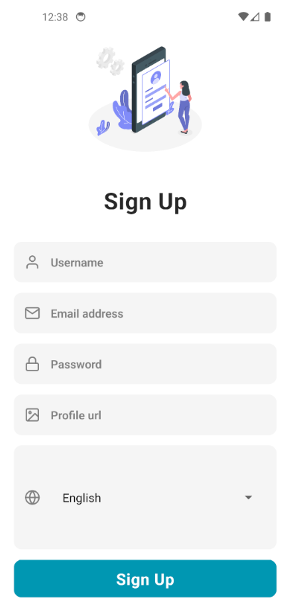

# ChatLingo: Real-Time Translation Chat Application

**Team Members:** Katie Foto, Arber Krashi, Peter Chaya, Abdul Rafi  
**Platform:** iOS & Android  
**Tech Stack:** React Native, Firebase, MarianMT, Flask

---

## 🌍 Introduction

**ChatLingo** is a real-time translation chat application designed to bridge linguistic gaps and facilitate seamless communication across languages. Built for mobile platforms (iOS and Android), our app empowers users to engage in meaningful conversations, regardless of their native language.

---

## 🚀 Features

- **Real-Time Translation** using MarianMT deep learning model
- **Automatic Language Detection and Switching**
- **Cross-Platform Chat Interface** (React Native)
- **Secure & Fast Communication** (Firebase backend)
- **Flask API Integration** for translation model access
- **User Authentication and Cloud Storage**
- **Clean and Responsive UI**

---

## 🎯 Target Use Cases

- **Business Communication**: Global teams and clients
- **Education & E-Learning**: Cross-cultural interaction and language learning
- **Travel & Tourism**: Communicating with locals
- **Social Networking**: Multilingual connections
- **Healthcare & Emergency**: Vital translation in critical moments

---

## 🔧 Tech Stack

| Layer      | Technology           |
|------------|----------------------|
| Frontend   | React Native         |
| Backend    | Flask (Python)       |
| Database   | Firebase Realtime DB |
| ML Model   | MarianMT (Transformer) |

---

## 🛠 Architecture Overview

1. **Frontend**: 
   - Developed with React Native for cross-platform support
   - Firebase handles authentication and real-time messaging

2. **Backend**:
   - Flask serves as a bridge between the frontend and translation model
   - REST API handles translation requests and communicates with MarianMT

3. **Translation**:
   - MarianMT provides accurate and context-aware translations
   - Transformer-based model with 6-layer encoder-decoder structure

---

## 🖼 Wireframes

Wireframes were designed using **Excalidraw** to visualize:
- Sign In / Sign Up screens
- Chat Interface
- Real-time translation flow

---

## 🛤 Roadmap

- Support for more languages beyond French & Spanish
- Advanced filtering (language, interest, location)
- Social features (profiles, status, group chats)
- Enhanced AI and translation accuracy

---

## 📱 Demo

### Sign Up Page

### Sign In Page

### Language Selector

### Chat List Page

### User 1 Text View 

### User 2 Text View

